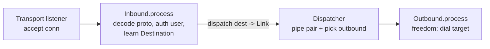

# AGENTS.md

Operating guide for agents working in **xray-rs**: a Rust rewrite of the *server*
(inbound) half of [xray-core](https://github.com/XTLS/Xray-core). Read this first, then
`SPEC.md` for the full design. Section refs below (§N, P-rules) point into `SPEC.md` —
it is the source of truth; this file is how to work, not what to build.

## What this is

A proxy **server**: decode what clients send (vless/trojan/shadowsocks/socks/http/vmess
inbounds), forward via **one** outbound (`freedom`, direct `connect`). Out of scope:
outbound proxy encoders, client dialers, routing-to-other-servers (§0).

**Compatibility, not transliteration** (§0). The Go tree is a *wire-format and behavior*
reference. Match the bytes on the wire and the observable handshake/timeout/auth
semantics; do **not** mirror Go's packages, interface graph, reflection DI, or
`MultiBuffer`. Prefer Rust idioms: enums over interfaces, ownership over GC, `?` over
`common.Must`.

## Layout

| Path | Role |
|---|---|
| `kernel/` | data plane (`Bytes`/`Link`/pipe/copy/timer), value types + shared address codec, DNS resolver, session ctx, `Instance`+config+`match` registry, dispatcher, in/outbound managers+workers, `freedom` outbound |
| `proxy/` | `InboundHandler` trait + `enum Inbound` + shared crypto/codec helpers + per-protocol handlers |
| `transport/` | listener registry, `Stream` enum + sockopts, tcp → httpupgrade → websocket → …, TLS (rustls) |
| `Xray-core/` | **read-only** Go reference (git submodule). Source of wire formats + test vectors. Never edit. |
| `SPEC.md` | the design spec. Cite it; don't duplicate it. |

Intended crate dependency graph: `proxy` and `transport` depend on `kernel`; `kernel` is
the base. Workspace is edition 2024, `resolver = "3"`; shared deps go in
`[workspace.dependencies]` (root `Cargo.toml`). The crates currently hold only scaffold
(`lib.rs` placeholder) — build them out per the milestone path.

## Commands

```sh
cargo build --workspace
cargo test  --workspace            # or -p kernel | -p proxy | -p transport
cargo clippy --workspace --all-targets
cargo fmt --all
```

Run the test you added/changed before yielding (M2: `curl --socks5`; M3: a real xray
client). Toolchain: cargo/rustc 1.95, clippy present.

## Non-negotiable rules (these bind every change)

These are lifted from `SPEC.md` §0.5; violating one is a defect, not a style nit.

- **P7 — never panic on the connection path.** Inbound handlers parse
  *attacker-controlled bytes*; a panic is a remote DoS. **No `unwrap`/`expect`/`panic!`/
  `unreachable!`/`todo!`/`unimplemented!`**, no unchecked indexing/slicing, no unchecked
  arithmetic on parsed values in library code. Put this at each library crate root and
  keep the build green under it:

  ```rust
  #![deny(clippy::unwrap_used, clippy::expect_used, clippy::panic,
          clippy::unreachable, clippy::todo, clippy::unimplemented,
          clippy::indexing_slicing, clippy::arithmetic_side_effects)]
  ```

  Use `buf.get(..)` / `split_at_checked` / `split_first` / `bytes::Buf` getters and handle
  the `None`; validate every length prefix against remaining bytes *before* slicing; use
  `checked_*`/`saturating_*`; `try_into()` over `as`-truncation. Propagate via `?` over a
  `thiserror` enum. Tests may relax with local `#[allow(...)]`; `expect` only for genuine
  start-up invariants.

- **P1 — static dispatch; sum with `enum`, never `dyn`.** The proxy/transport/outbound
  sets are closed and known at compile time. Prefer monomorphized generics
  (`fn f<D: Dialer>(d: &D)`). When one value holds *one of several* concrete types, make an
  `enum` that implements the trait by delegating its `match` arms. Sums to build:
  `enum Inbound`, `enum Outbound`, `enum AnyDialer`, `enum Stream` (**box the TLS variant**
  so the enum stays pointer-sized). No `Box<dyn>`/`&dyn` on the hot path. `#[enum_dispatch]`
  is allowed for boilerplate; hand-written `match` is fine for ≤6 variants.

- **P2 — immutable shared state; swap-and-drain over locks.** Live config is
  `Arc<Config>` (deeply immutable), published via `arc_swap::ArcSwap`, **not**
  `Arc<RwLock<_>>`. A worker clones one snapshot at `accept()` and holds it for the whole
  connection. Reload = build a new `Instance`, start it, drain the old. Same for user
  tables (validators hold `Arc<UserTable>`; add/remove rebuilds + swaps). No shared mutable
  state on the data path.

- **P3 — `Bytes` for handoff, `BytesMut` only while filling.** Copy loop owns a reusable
  `BytesMut` window; after a read, `split().freeze()` → `Bytes` and hand that to the
  `Link`. Untouched chunk → stays `Bytes` end-to-end, zero copies. `BytesMut` only where
  you rewrite in place (response headers, in-place AEAD decrypt).

- **P4 — cheap domain values; cache DNS.** `Address::Domain` is
  `compact_str::CompactString` (default) or `Arc<str>` — **never** bare `String`. The
  `freedom` outbound resolves domains through a shared `Arc<Resolver>` backed by a `moka`
  cache (honor TTLs clamped to sane min/max, cap entries, dedupe in-flight lookups).

- **P5 — reach for a crate before hand-rolling a lower layer.** TLS → `tokio-rustls`;
  WebSocket → `tokio-tungstenite`; HTTP/1+2 → `hyper`/`h2`; QUIC/h3 → `quinn`(+`h3`),
  never hand-rolled QUIC; crypto → RustCrypto (`aes-gcm`, `chacha20poly1305`, `hkdf`,
  `sha1`/`sha2`, `md-5`, `hmac`, `crc32fast`), `uuid`, `x25519-dalek`. Hand-roll **only**
  what has no crate or where the format *is* the product: proxy header codecs, SS/VMess
  AEAD chunk framing, mkcp (deferred).

- **P6 — test protocols first, from the Go vectors.** See Testing below.

## The pipeline (§1)



Two core traits (§1): `InboundHandler::process(ctx, net, conn: Stream, disp: &Dispatcher)`
and `OutboundHandler::process<D: Dialer>(ctx, link: Link, dialer: &D)`. Note the deltas
from Go: dispatcher is **one concrete type** (`&Dispatcher`, not generic); dialer is a
**generic `D: Dialer`**, not a trait object.

Per-connection lifecycle inside `process` (§1): handshake read-deadline (60s) around the
header read → authenticate via per-protocol validator (`Arc<UserTable>`) → derive target
`Destination` → clear deadline, start idle timer (300s) → `dispatch`/build `Link` → two
copy loops (uplink `conn→writer`, downlink `reader→conn`), first error wins,
close-writer-on-uplink-EOF (`try_join!`/`select!`). The `Link` is a bounded
`mpsc::<Bytes>` pair (backpressure); dropped sender = EOF; `CancellationToken` = interrupt.

## Codec shape (§2e)

Per protocol: a **pure, I/O-free** `Header` parse/encode pair over `Bytes`/`BytesMut`
(mirrors Go's `ParseHeader`/`ConnWriter`), then a thin async wrapper that reads off
`Stream` into the parser. The pure core is what the tests exercise. Centralize shared
crypto in one module: AEAD chunked stream (SS + VMess body), `EVP_BytesToKey`+`HKDF-SHA1`,
VMess `KDF`/`CreateAuthID`/cmdKey, FNV-1a. The shared SOCKS-style **address codec**
(§2b) is implemented **once**, parameterized by family (A: VLESS/VMess; B: Trojan/SS/SOCKS)
and order — do not fork six near-identical copies.

## Testing (P6 / §6)

Port the Go golden vectors to `#[test]` **before** writing the decoder, then code to
green. Tests are `BytesMut` round-trips with **no sockets** (write header → `freeze()` →
parse → assert `Destination` + payload). Add adversarial cases the Go tables already
encode — truncated input, wrong length byte, bad auth — and assert they **error, not
panic** (this is how P7 is verified).

| Rust target | Go source of truth |
|---|---|
| shared address codec | `common/protocol/address_test.go` |
| `Uuid::parse_str` | `common/protocol/id_test.go` |
| time window | `common/protocol/time_test.go` |
| Trojan header | `proxy/trojan/protocol_test.go` |
| VLESS encoding | `proxy/vless/encoding/encoding_test.go` |
| Shadowsocks | `proxy/shadowsocks/protocol_test.go`, `config_test.go` |
| VMess AEAD | `proxy/vmess/aead/{authid,encrypt}_test.go`, `encoding/encoding_test.go`, `validator_test.go` |
| sniffers | `common/protocol/{tls,http,quic}/sniff_test.go` |

## Milestone path (§5) — each ships a working server

1. **M1 skeleton:** kernel data plane (`Bytes`/Link/copy/timer) + value types + session
   ctx + dispatcher + in/outbound managers + `freedom` (with `moka` DNS cache) + raw `tcp`
   listener.
2. **M2 first proxy:** `socks` (and/or `dokodemo`) over raw TCP, no crypto. Verify with
   `curl --socks5`.
3. **M3 TLS-fronted:** rustls listener + **Trojan** + **VLESS(none)** (header-parse-only;
   TLS carries encryption). Verify against a real xray client.
4. **M4 Shadowsocks** (AEAD chunk stack + key schedule) + UDP path.
5. **M5 transports:** `websocket` + `httpupgrade`.
6. **M6+ optional:** VMess, router+sniffer+policy, gRPC/XHTTP (h3 via `quinn`), REALITY,
   XTLS Vision, mux, splice fast path.

Minimum viable server is **M1–M3**. Work top-down through the path; each milestone is
independently shippable.

## Working norms

- Search before guessing; reuse the existing pattern rather than introducing a second
  convention. Use `lsp` for symbol-aware edits/refs, `ast_grep`/`search` for discovery.
- The Go tree under `Xray-core/` is reference only — read it, never modify it.
- Keep parse/encode I/O-free; keep the connection path panic-free; run `cargo clippy`
  (with the P7 deny lints) and the relevant tests before yielding.
- Defer the hard/optional layers (REALITY, mkcp, XHTTP, Vision) as `SPEC.md` marks them;
  don't pull them forward to look complete.
