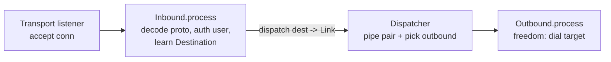

# xray-rs

A Rust rewrite of the **server (inbound) half** of
[xray-core](https://github.com/XTLS/Xray-core). It decodes what proxy clients send —
VLESS, VMess, Trojan, Shadowsocks, SOCKS5, HTTP, dokodemo — and forwards each connection
through one direct outbound (`freedom`), with optional routing and traffic sniffing.

The goal is **wire-format and behavior compatibility, not transliteration**. The Go tree
under `Xray-core/` is a read-only reference for the bytes on the wire and the observable
handshake/timeout/auth semantics; the Rust code is idiomatic (enums over interfaces,
ownership over GC, `?` over `common.Must`) and does not mirror Go's package graph,
reflection DI, or `MultiBuffer` plumbing.

See [`SPEC.md`](SPEC.md) for the full design and [`AGENTS.md`](AGENTS.md) for working
conventions.

## Scope

In scope (server side):

- Inbound protocol decoders (VLESS / VMess / Trojan / Shadowsocks / SOCKS / HTTP / dokodemo)
- Inbound stream transports + server-side TLS
- A dispatcher, a `freedom` direct outbound and a `blackhole` outbound, plus routing + sniffing

Out of scope: outbound proxy encoders, client dialers, routing to other proxy servers.
Deliberately deferred (see below): REALITY, XTLS Vision, mKCP, XHTTP/SplitHTTP, SS2022.

## Feature matrix

| Layer | Implemented |
|---|---|
| **Inbound protocols** | VLESS (`flow=none`), VMess (AEAD), Trojan, Shadowsocks (AEAD), SOCKS5, HTTP CONNECT, dokodemo-door |
| **UDP** | SOCKS5 UDP ASSOCIATE, Trojan/VLESS/Shadowsocks UDP, dokodemo |
| **Mux** | inbound mux.cool de-multiplexing |
| **Transports** | raw TCP, WebSocket, HTTPUpgrade, gRPC |
| **Transport security** | plain (none) and TLS (OpenSSL via `tokio-openssl`) |
| **Outbounds** | `freedom` (direct, cached DNS), `blackhole` |
| **Routing** | first-match rules over domain (`full:`/`suffix:`/`keyword:`) and IP CIDR |
| **Sniffing** | TLS SNI, HTTP Host |
| **Shadowsocks ciphers** | aes-128-gcm, aes-256-gcm, chacha20-ietf-poly1305, xchacha20-ietf-poly1305 |

## Binaries

The workspace produces two server binaries.

### `xray-rs` — standalone server (crate `app`)

Reads a self-contained TOML config describing inbounds, outbounds and routing, then serves.

```sh
cargo run -p app -- config.toml
# or after a release build:
xray-rs config.toml
```

Config reference: [`config.example.toml`](config.example.toml). Log level comes from the
config's `[log] level` or the `RUST_LOG` env var (e.g. `RUST_LOG=info,proxy=debug`).

### `xray-saas` — panel front-end (crate `saas`)

An [XrayR](https://github.com/XrayR-project/XrayR)-compatible front-end: it polls a
subscription panel for node config and the user list, builds the matching inbound, syncs
users into the live handler, and reports per-user traffic back to the panel. Panel type
**SSpanel** is supported; node types V2ray / Vmess / Vless / Trojan / Shadowsocks.

```sh
cargo run -p saas -- config.toml
# or after a release build:
xray-saas config.toml
```

Config reference: [`saas/config.example.toml`](saas/config.example.toml) — XrayR's
`config.yml` translated to TOML with the original PascalCase key names. Keys for
out-of-scope features (REALITY, fallback, limiter, custom DNS/inbound/outbound) are parsed
and ignored.

## Architecture



A connection flows: transport listener accepts and layers security + transport into a
`Stream` → the inbound handler reads the proxy header under a handshake deadline,
authenticates against an immutable user table, and derives the target `Destination` → the
dispatcher builds a bounded in-process `Link` (mpsc duplex, backpressure) and picks an
outbound → two copy loops pump bytes, first error wins.

### Workspace layout

| Crate | Role |
|---|---|
| `kernel/` | data plane (`Bytes`/`Link`/pipe/copy/timer), value types + shared address codec, cached DNS resolver, session ctx, dispatcher, router, sniffers, `freedom`/`blackhole` outbounds |
| `transport/` | listener + sockopts, `Stream` enum, TLS (OpenSSL), raw TCP / WebSocket / HTTPUpgrade / gRPC |
| `proxy/` | `Inbound` sum + per-protocol handlers + shared crypto/codec/UDP/mux helpers |
| `app/` | the `xray-rs` standalone-server binary + its TOML config |
| `saas/` | the `xray-saas` panel front-end binary + SSpanel client and node/user builder |
| `Xray-core/` | read-only Go reference (submodule): source of wire formats + test vectors |
| `XrayR/` | read-only Go reference (submodule): panel-integration behavior reference |

Dependency direction: `proxy` and `transport` depend on `kernel`; the two binaries depend
on all three. Edition 2024, `resolver = "3"`; shared deps live in
`[workspace.dependencies]`.

## Design principles

Binding rules (full text in `SPEC.md` §0.5 / `AGENTS.md`):

- **P1 — static dispatch.** Closed sets are `enum`s that implement a trait by delegating a
  `match` (`Inbound`, `Outbound`, `Stream`, `TransportKind`); no `Box<dyn>`/`&dyn` on the
  hot path. The large TLS `Stream` variant is boxed to keep the enum pointer-sized.
- **P2 — immutable shared state.** Live config and user tables are `Arc`-snapshots published
  via `arc_swap`; a worker clones one snapshot at accept and holds it for the connection.
  Reload / user change = rebuild + swap, never a lock on the data path.
- **P3 — `Bytes` for handoff, `BytesMut` only while filling.** Untouched chunks stay
  zero-copy end to end.
- **P4 — cheap domain values + cached DNS.** `Address::Domain` is `CompactString`; the
  `freedom` outbound resolves through a shared `moka`-backed resolver honoring TTLs.
- **P5 — reach for a crate before hand-rolling a layer.** TLS/WS/HTTP/crypto come from
  mature crates; only the proxy header codecs and AEAD chunk framing are hand-rolled.
- **P7 — never panic on the connection path.** Inbound handlers parse attacker-controlled
  bytes, so a panic is a remote DoS. Each library crate root denies
  `unwrap_used`/`expect_used`/`panic`/`unreachable`/`todo`/`unimplemented`/
  `indexing_slicing`/`arithmetic_side_effects`; malformed input returns `Err`, never unwinds.

## Building

Toolchain is pinned by [`rust-toolchain.toml`](rust-toolchain.toml) (Rust 1.96).

```sh
cargo build --workspace
cargo test  --workspace            # or -p kernel | -p proxy | -p transport | -p saas
cargo clippy --workspace --all-targets
cargo fmt --all
```

For a portable release binary, enable the `vendored` feature to statically link OpenSSL
(only glibc remains as a runtime dependency):

```sh
cargo build --release -p app  --features vendored
cargo build --release -p saas --features vendored
```

Tagged pushes (`v*`) build, strip, checksum and publish both binaries for
`x86_64-unknown-linux-gnu` via [`.github/workflows/release.yml`](.github/workflows/release.yml).

The Go submodules are reference-only and **not** required to build:

```sh
git submodule update --init   # only if you want the Go reference + test vectors
```

## Testing

Protocol correctness is test-driven from the Go golden vectors (P6): header and crypto
codecs are pure functions over bytes, exercised by socket-free `BytesMut` round-trips
(write header → `freeze()` → parse → assert `Destination` + payload), including
adversarial cases — truncated input, wrong length byte, bad auth — asserted to **error,
not panic** (which is how P7 is verified). The `saas` crate adds a mock-SSpanel
integration test covering the panel client and the controller's bind + traffic-report
loop.

```sh
cargo test --workspace
```

## Deferred / out of scope

Intentionally not implemented (mirrors `SPEC.md` priorities): REALITY, XTLS Vision, mKCP,
XHTTP/SplitHTTP (the h3 leg requires `quinn` + `h3`), Shadowsocks-2022, hot config reload,
and stats export. These are noted where an inbound would otherwise reuse a shared codec;
they are not stubbed to look complete.
